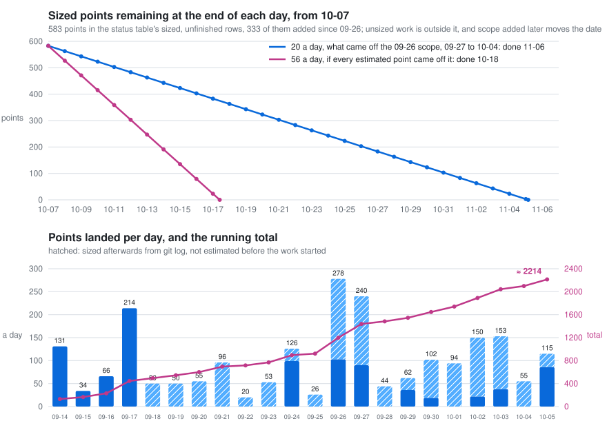
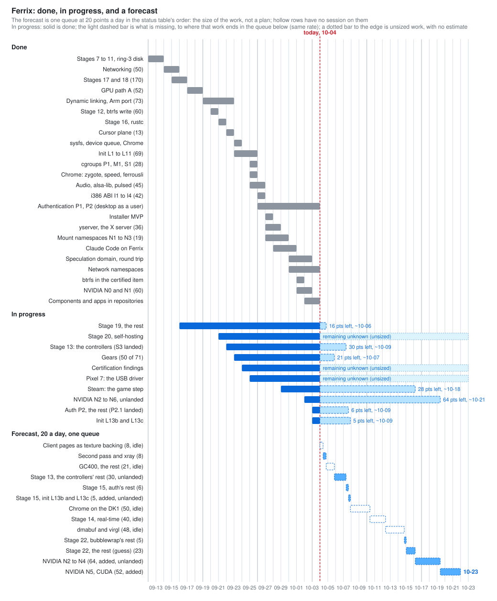

# Status, estimates and forecast

*Rows reviewed 2026-10-05, to `main` cf30aa08f; the velocity count and the
two charts below now run through 2026-10-05.* Over the four days of
the points era that the fleet ran, 2026-09-14 to -17, about 445 points
landed: 131, 34, 66 and 214, which is ≈ 111 a calendar day and ≈ 150 a day
the fleet was running, with 8–10 sessions, 15–20 points a session-day, and
21 points a queue-hour on both days that were measured finely. Every
estimate under 8 held, and stages 17 and 18 came in at the sizes they were
given (`docs/BACKLOG.md`, *Velocity*). The count since then, to 2026-09-24,
is ≈ 870 points in 11 calendar days (≈ 79 a day), and 2026-09-24 alone
landed ≈ 99, about 22 an hour over the landing window, on a code base of
703 k lines of Rust. Counted again on 2026-09-26, the total was ≈ 1,200
points in 13 calendar days (≈ 92 a day). Counted again now, to 2026-10-01,
five more calendar days landed ≈ 542 points (≈ 108 a day of the days
counted this time), of which ≈ 145 were estimated before the work started
(the i386 ABI's 42, the sound stack's 21, authentication's phase 1 27,
yserver's 36, and N1 to N3 of Steam's namespaces' 19) and the rest, ≈ 397,
sized afterwards from `git log`, in clusters, the same way as before
(`docs/BACKLOG.md`, *Velocity*, "Update, 2026-10-01"). Counted once more, to 2026-10-04, three more calendar days landed ≈ 358
points (≈ 119 a day), of which ≈ 60 were estimated before the work started
(NVIDIA's N0 and N1) and the rest, ≈ 298, sized afterwards from `git log`
(`docs/BACKLOG.md`, *Velocity*, "Update, 2026-10-04"). Counted once more, to 2026-10-05, one more calendar day landed ≈ 115
points, of which ≈ 86 were estimated before the work started (NVIDIA's N2 to
N4 64, stage 20's S-2 5, FX-1012 6, the stage 10 seam panic 4, the Windows
gateway's peek 4, `bench-ipc` made exact 1, init's L13b 2) and the rest, ≈ 29,
sized afterwards from `git log` (`docs/BACKLOG.md`, *Velocity*, "Update,
2026-10-05"). The running total is
**≈ 2,214 points in 22 calendar days, ≈ 101 a day**, or ≈ 1,264 (≈ 57 a day)
counting only what had an estimate before it started. That is historical
velocity, not a current schedule, and not the rate the roadmap's scope
falls at: of the ≈ 1,015 points that landed from 2026-09-27 to 10-05, only
≈ 158 came off the scope sized on 09-26, ≈ 20 a day to 10-04 and ≈ 18 a day
counted to 10-05, since nothing of that scope landed on 10-05 (L13b, S-2 and
NVIDIA's N2 to N4 are rows added after it); the forecast keeps 20. The
*Burndown* below forecasts the sized scope, ≈ 647 points as of 2026-10-05, at
that rate.
The table records the state now.
Stages 12 to 16 were sized in words before points existed; their points are
first guesses rather than an owner's estimate and are replaced when a session
sizes them.

| what | points | current state |
|---|---|---|
| ~~Stage 19: the GPU path, Path A (`docs/GPU.md` §3)~~ *done 2026-09-19* | ~~52~~ | done |
| ~~Stage 19: the cursor plane (`docs/GPU.md` §3.10)~~ *done 2026-09-23* | ~~13~~ | done |
| ~~Stage 19: the device queue, commands in flight and a frame that waits once (`docs/GPU.md` §3.11)~~ *done 2026-09-24* | ~~13~~ | done |
| Stage 15, a real userland | *week* ≈ 20, of which job control is spent; most of the rest landed as zinc and uutils, and what is left is an init, sized at 67 points in `docs/INIT.md` §13, of which all 67 of L1 to L10 are spent, L11's 2 too, and 16 later; authentication (`docs/AUTH.md`, approved 2026-09-26): a kernel fix first (P0) 2, spent, phase 1 27, phase 2 31 and phase 3 about 32 later; init's L13, the sandboxing keys (10), of which L13a (5: `NoNewPrivileges=`, `PrivateTmp=`, `ProtectSystem=`) landed 2026-10-04, L13b (2: `PrivateNetwork=`) landed 2026-10-05 (3349682db), and L13c (3: `SystemCallFilter=`) is built on branch `po6/l13c`, its batch failing one `test-vfs` cgroup `rmdir` that `main` passes | init done (L1 to L10, 2026-09-26): `run` and every desktop image boot `/sbin/init`, with `getty`, `svc`, readiness, socket activation, resource limits and the directory over `src/lib/init/svc`; L11 (`devmgr` on its restart policy) done too; L12 is later by design, and of L13 the first two parts, L13a (2026-10-04, 1e1f2543a) and L13b (2026-10-05), landed; authentication's P0 -- `process_create` gave a child root's credentials -- is fixed (2026-09-26), and phase 1 is done (hyprlock's lock goes over `authd`, 2026-10-03); phase 2, the desktop as a user, is done but for K-C (P2.2, not started): `getty`'s revoke of the console before every login (0f94a6d1a) and K-B (P2.1, NP, 7e9a2806f) landed 2026-10-04 |
| ~~Stage 19: an X server, XWayland's 40~~ *done 2026-09-29 as yserver (`docs/YSERVER.md`)* | ~~40~~ 36 spent | done |
| Stage 13, namespaces, cgroups, seccomp | cgroups 85 (`docs/CGROUPS.md` §7: 27 for what init needs, 58 for the controllers); namespaces and seccomp unsized, the old guess for the whole stage was *month* ≈ 60 | under way, 2026-10-04: mount, user, UTS, IPC, cgroup, pid and network namespaces are in (network: 22384874f); seccomp filters (S3) landed 2026-10-04 (248799bdd); G1 to G5 done (27), which is all init needs from it, C8 for native services included; `pids`, `memory`'s charging and `cpu.weight` done (2026-09-26, as the certification's job quotas), and `memory`'s scoped OOM kill the same day (P1, M1, S1: 28), so 55 of 85; the rest of `memory.stat`, `memory`'s reclaim, freezing, `cpu.max` and `io` left, about 30; Steam's user and mount namespaces sized at 39 (`docs/NAMESPACES.md` §9), N1 to N3 done (19; N3 took `openat2` besides, which bubblewrap 0.12 needs); time namespaces and S4 to S6 are on branches (`docs/roadmap/stage-13-handover.md`); the controllers (reclaim, freezing, `cpu.max`, `io`) are built and gated, 23 negative controls fired, and wait for the consultant's review of the D1 fix (`po6/cgctl`, `po6/cgctl-n6`; not landed) |
| `run-compositor --everything` carries everything: every volume, every app, nothing silently left out (the customer's rule, 2026-10-01) | unsized | under way: the volumes are fetched when missing, and a failed fetch stops the run (f7777c17, 2026-10-01); Steam in fuzzel (cb21ecd8); on 2026-10-05 the volume's X11 link took the place of the xkb placeholder (cf30aa08f; the command had failed on `main` with kernel panic FX-0801) and component checkouts on Windows keep their own objects and LF files (0d7520d82, 1752580c1); every app and btop built on Windows are os-3c's, next |
| The desktop's own clients: waybar, fuzzel, hyprlock and hypridle in Rust, reading the customer's own files (`docs/DESKTOP-CLIENTS.md`) | the foundation they share 21 (`docs/BACKLOG.md`); the four programs unsized | under way: the foundation's crates and hypridle on `main` (2026-09-26); waybar, drawing the customer's bar on the desktop, and fuzzel's window, run by their launcher script, on `main` and gated by boots (2026-09-27); hyprlock checks a password through `authd` on every desktop (2026-10-03); since 2026-10-04 hypridle, hyprlock, waybar, fuzzel and term are apps in `ferrix-os/apps`, built by xtask from their folders, and foot takes keys (every compositor image carries libxkbcommon's `xkb` directory; `test-foot`'s typed-line check runs since f55e8ab28, 2026-10-04) |
| Certification findings (`docs/certification/FINDINGS.md`), the work inside the repository | 165 (range 130-210, mostly guess): C1 debt after landings 10 (firm), C2 to C4 F-56's btrfs evidence 10 + 11 + 8, C5 to C7 F-15 and F-16 low-level requirements 24, C8 to C10 F-14 checks with controls for the 322 baselined requirements 33, C11 and C12 F-10 coverage 16, C13 F-18 and F-19 generator and coverage-tool verification 10, C14 coding standard and a change-impact gate 10, C15 the planning set 13, C16 EAL5 design evidence 13, C17 F-43 and F-52 8 | in progress; 2026-10-05, on `main`: F-62, a carry nobody made, filed and closed (the gate now fails on it), the item's load ring refuses a member that matches no file, and F-63, the chardev queue's bound, filed and closed; excluded, and not counted: freedom from interference across ring 0 (90-160, a row of its own), F-13 and ISO 26262; the steps outside the repository (the pre-assessment, the QMS F-28, independent reviewers F-27, Ferrocene F-17, a CC lab) carry no points |
| Stage 21, bare metal and a GPU of Ferrix's own | over 100, unsized | under way on NVIDIA's own driver (`docs/NVIDIA.md`): N0, the kernel prerequisites, and N1, `nvrm` booting the RTX 3060's GSP with `nvidia-smi`, are on `main` (2026-10-03), and the chardev core's queue bound (F-63) with stage 10's chardev self-check (N10's code half, N12, N13) since 2026-10-05; N2 to N4 (`vulkaninfo`, Chrome's WebGL) and N6 (the desktop on the customer's TV over HDMI, 1920x1080@60, with host keyboard and mouse passed in) landed on 2026-10-05 as `land-n6` (a84992dc5, batch 20261005T190105Z); `nvidia-n2`'s tip does not build; next N3b (dmabufs), a hardware cursor, and measuring page loads |
| Stage 22, Steam: the parts with a first guess (bubblewrap's rest 13, sound 30, Venus 8; glibc's names are dynamic linking's 13 and XWayland stage 19's, both counted above) | 51; sound re-sized by `docs/AUDIO.md` as 24 for the driver, the core and a gate, spent, then alsa-lib 3 (U1) and a server unsized (U2), so 24 of the 51 left sized | sound done: playback 2026-09-26 -- a ring-3 virtio-snd driver, the audio core, `/dev/snd`, `test-audio`, Chrome playing through it, and `run-compositor --everything` bringing the card -- then alsa-lib (U1) and `pulsed`, the PulseAudio-protocol server (U2a to U2d, 18 points), 2026-09-27; bubblewrap waits on namespaces (N1 and N2 done, see stage 13; its rest re-sized on 2026-10-05 from 5 to 16 after the consultant found B1 and B2, and N5 and `bwrap-user` are parked on branches); Venus not started |
| ~~Dynamic linking: the kernel half, ferrousli's loader, glibc's names~~ *done 2026-09-23* | ~~39~~ | done |
| ~~Dynamic linking: ferrousli's AArch64 and ARMv7-A port, which the customer put inside the stage on 2026-09-21~~ *done 2026-09-23* | ~~≈ 34~~ | done |
| ~~Stage 12, btrfs write~~ *done 2026-09-21* | ~~≈ 60~~ | done |
| ~~sysfs, fed by the services that own each fact (`docs/SYSFS.md`)~~ *done 2026-09-24* | ~~26~~ | done |
| ~~Chrome on Ferrix, headless and in a window, x86-64 (`docs/CHROME.md`)~~ *done 2026-09-24* | foot and its ports 13, the kernel's rows ≈ 30, spent | done |
| ~~Chrome: the zygote, its speed, ferrousli in glibc's place headless and in a window, the persistent btrfs root~~ *done 2026-09-26* | unsized, spent | done |
| ~~Chrome: `inotify`~~ *done 2026-09-27 (ferrix-e4)* | unsized, spent | done |
| Chrome: the GPU | unsized | under way on NVIDIA's card (stage 21): WebGL renders on the RTX 3060 through ANGLE on NVIDIA's Vulkan, 44–53 fps with software compositing; on `main` since 2026-10-05 (`land-n6`); dmabufs for GPU compositing (N3b, half built on `nvidia-n2`) next |
| Stage 19: the desktop's speed as it is watched (`docs/GPU.md` §3.9): client pages as texture backing | 8 | in progress |
| ~~Claude Code on Ferrix, the command line, x86-64, and `claude` on the `--everything` desktop (`docs/CLAUDE-CODE.md`)~~ *done 2026-09-30* | unsized, spent: the volume and gate, and `XSAVE` in the kernel | done |
| ~~Claude Code: the interactive TUI gated, the launcher, Zenbleed and GDS~~ *done 2026-09-30* | unsized, spent | done |
| ~~Claude Code on ferrousli, as the `--everything` desktop runs it: the POSIX timers, the gate on ferrousli~~ *done 2026-10-01* | unsized, spent | done |
| Claude Code: a real account, AArch64, the i386 frame's AVX state | unsized | not started |
| The Claude desktop app, which Anthropic builds for macOS and Windows only (`docs/CLAUDE-CODE.md` §7) | unsized until assessed | assessment next |
| The Pixel 7, the customer's phone (`src/boot/vendor/google/pixel7/HANDOVER.md`) | the desktop in the launcher app's VM done; the USB device driver done (2026-09-26); what remains of USB 37 (range 30-50: U-1 robustness 5, U-2 onto `ferrix-driver` 5, U-3 input over the port and a shell on ttyACM 8, U-4 LPM and suspend 5, U-5 SuperSpeed through the Tensor combo PHY 13, which could be 21; all but U-0 need the phone) | under way: `main` boots it natively on all eight cores to `FERRIX-BOOT-OK stages 1-12`, and as a guest of the phone's own crosvm from a launcher app, with a monitor graphing the boot and `ferrix-statd`'s samples (2026-09-26); the customer chose the VM for a desktop the same day (option A), and it runs there with Chromium on it (2026-09-27); the USB device driver landed 2026-09-26, a CDC-ACM "Ferrix console" (1209:0001) carrying the boot log and `ferrix-statd`'s samples, and adb over the same port on 2026-09-27 (`docs/vendor/google/pixel7/USB-HANDOVER.md` §8) |
| Stage 19: `dwindle:precise_mouse_move`, the second-pass effects and the window rule `xray` | about 8 | in progress |
| Gears (`docs/GPU.md` §6, the customer's order of 2026-09-24): vkgears through Venus on the Linux host 39, which is also stage 22's "Venus 8" and more; GLES2 gears on the DK1's GC400 32 | 71 | under way: vkgears draws through Venus (39 done, 2026-09-24); the GC400 runs a command buffer on the board, its events by interrupt (G1 and G2, 11 of its 32, 2026-09-24) |
| Stage 22, Steam: the 32-bit x86 ABI and what the runtime and Proton find missing | unsized, ≈ 100 as a guess; `docs/I386.md` sizes I1 to I4 at 42, I5 unsized | under way: I1 to I4 done (42 of 42): 32-bit programs, their threads, signals and fork, and Alpine's and Debian's i386 busybox; I5a, Valve's `steamcmd` logging in, 2026-09-27; yserver, the X server, 36 points, 2026-09-29; Steam's sign-in window on hyprix through yserver 2026-09-29; the client signs in and shows its store on the `--everything` desktop under ferrousli, gated by `test-steam-store`, 2026-09-30; launch-side workarounds left (`docs/STEAM.md` §3), the GPU process's route designed, 14 to 23 points (§6); a game from the library gated by `test-steam-game`, 2026-10-01, not passing yet: the install downloads and then stalls staging, cause not yet known (§7) |
| The installer (`docs/INSTALLER.md`, approved 2026-09-28) | the MVP spent; the rest in §9 | under way: the MVP, `ferrix-install` onto a VM's disk and `test-install`, 2026-09-28; the full root, the ISO, the boot menu, the graphical installer, Secure Boot, shrinking and real PCs left |
| Stage 14, real-time domains | *month* ≈ 40 | not started |
| After stage 19's 178: `zwp_linux_dmabuf` with a GBM-shaped allocator, and Mesa's virgl on ferrousli, for clients that draw on the GPU themselves (`docs/BACKLOG.md`) | 8, and 40 or more | not started |
| ~~Stage 16, `rustc`~~ *exit met 2026-09-22* | ~~*the goal* ≈ 40~~ 8 spent | done |
| Stage 20, self-hosting | 45 left (range 40-75; S-0, CI green, and S-2, plan mode complete, are met): S-1 FX-0001 under load 8 (3-13, a guess), S-3 the whole 188-build x86-64 plan on Ferrix 8, S-4 the script apps' toolchain 8, S-5 Arm toolchains in the guest 6, S-6 replay all 57 rows from the Ferrix store 8, S-7 the weekly CI workflow 5, S-8 the exit record 2 (S-8 firm, the rest guesses); not counted: if "three architectures" means the compiler runs on ARMv7-A Ferrix, 13 or more | in progress: the x86-64 image builds on Ferrix and boots (2026-09-23); the AArch64 image builds on Ferrix on the Pixel 7 and boots (2026-10-03); every build of the matrix recorded, Ferrix making them stops on FX-0001 (2026-09-24); 2026-10-04, on `main`: one kernel for every test, each test's init program and script in the initramfs under `.ferrix/init/` (the plan falls from 271 builds to 188), a 57-row matrix, and a plan mode that records builds without booting (`selfhost-matrix`); the volume carries the components and the guest clones none, which fixes CI's "rustc on Ferrix, and Ferrix built on Ferrix" job (`selfhost-components`, cb872a732; CI's job has passed on `main` since 77783565a); 2026-10-05, on `main` (ce133294c, a3b240c6b): the plan is complete, `test-threads`, `test-procfs`, `test-display`, `test-input`, `test-audio`, `test-badapple` and `test-compositor` build every variant before their first boot (162 distinct builds against 139); owed: a weekly CI job, and the apps and Arm C programs built by Ferrix |
| Chrome on the STM32MP157D-DK1 (`docs/CHROME.md` §10) | ≈ 45–55 | not started |
| Live driver updates: a new driver version without a reboot. `devmgr` starts a driver it restarts from a new, verified image instead of the initramfs copy, and goes back to the old one if the new one does not publish (the customer's question, 2026-10-05; `docs/DEVMGR.md` §4) | 26, a first guess: D1 a new image's way into `devmgr` (every driver image comes from the initramfs today) 8, D2 the update command and the rollback 5, D3 the image's verification and the certification review 5, D4 `test-restart --update` for each kind with its negative controls 5, D5 requirements and docs 3; the kinds `devmgr` does not restart today (the serial port, the USB host, the GC400 engine, the USB gadget, a GPU under `nvrm`) and `devmgr`'s own restart (`docs/INIT.md` L12) are outside it | not started; what it builds on, restarting a display, sound, network, input or disk driver with its device's state kept, is done (T0, 2026-09-27, `cargo xtask test-restart`) |
| The native channel round trip as fast as seL4's, 440 ns on nazuna with matched protections (`docs/OPAQUE-KERNEL.md` §9.5 to §9.9, the customer, 2026-10-02) | 69 left, range 60-90 (§9.5 and §9.7's estimates): 2f about 9 (the exact `bench-ipc`, 1, landed 2026-10-05), step 3 without PCIDs 7-11, step 4's fast path 39-59, step 5 5-11; step 3's PCIDs (10-13, nazuna has none) and step 4b are outside it | under way: step 1, F-60's fix and 2a to 2e on `main`, 2,556 ns p50 inside a domain with every mitigation on (37 us before step 1); 2026-10-05: `bench-ipc` made exact landed (3349682db); 2f is gated and waits for the consultant's conditions (`po6/step2f`, session po6-ipcA); steps 3a and 3b are in progress (`po6/step3`, WIP, owed boots, controls and review); `step4-prep` waits for review (`docs/handover/2026-10-03-ipc.md`) |

## Burndown

Scope is the table's sized, unfinished rows on 2026-10-05, after the day's
landings: client pages 8, the second pass and `xray` 8, the GC400's remaining
21 of 32, stage 13's rest 30 (the controllers, built and waiting for review), stage 15's 9
(init's L13c 3, built and waiting to land, and authentication's rest 6),
Chrome on the DK1 50, stage 14 40, dmabuf and virgl 48, stage 22's 39
(bubblewrap's rest 16, re-sized from 5 on 2026-10-05, and a guess of 23 for
what the Steam client's launch and games still find missing), NVIDIA's N5,
CUDA, 52 (N2 to N4's 64 landed on 2026-10-05), stage 20's 45, what remains of
the Pixel's USB work 37, the certification's work inside the repository 165,
live driver updates 26 and the channel round trip's rest 69 -- **≈ 647
points**. The unsized rows (the rest of stage 21, the audio server, Chrome's GPU
compositing, the desktop clients' programs) and the certification's ring-0
interference work (90-160) are outside it, so the chart shows when the *sized* work ends, not when the
roadmap does.

### Why the date moved

The 2026-09-24 forecast was 475 points, done 10-01 to 10-03; the 09-26
forecast was 442 points, done 10-01 to 10-03 at 67 to 92 a day. Neither
held, and the count of what happened to the 442 says why:

| what | points |
|---|---|
| sized scope on 2026-09-26 | 442 |
| came off it by landings (yserver 40, stage 15's 27, the clients' foundation 21, the Pixel's VM desktop 17, i386's I1 to I4 42, stage 22's sized part ≈ 11, init's L13a 5, auth's P2.1 2) | − ≈ 165 |
| came off it by a lower guess (stage 22's rest, Venus) | − ≈ 43 |
| added (NVIDIA's N2 to N5 116, init's L13 10) | + 126 |
| sized scope after the day's landings | 360 |
| added by sizing three rows that had none (stage 20 50, the Pixel's USB rest 37, the certification's repository work 165), 2026-10-04 evening | + 252 |
| sized scope on 2026-10-04, evening | 612 |
| came off it by landings on 2026-10-05 (stage 20's S-2) | − 5 |
| added on 2026-10-05 (live driver updates 26, a first guess; the channel round trip's rest 70, which had no row) | + 96 |
| sized scope on 2026-10-05, at the forecast of the afternoon | 703 |
| came off it by landings on 2026-10-05, evening (NVIDIA's N2 to N4 64, init's L13b 2, `bench-ipc` made exact 1) | − 67 |
| added by re-sizing (bubblewrap's rest, 5 to 16, after the consultant's B1 and B2; parked) | + 11 |
| sized scope on 2026-10-05, at wind-down | 647 |

1. **The rate counted work outside the scope.** About 900 points landed in
   those eight days, but ≈ 695 of them were sized afterwards from `git log`:
   the certification, the speculation domain, the components split, Claude
   Code, the installer, the network namespaces. That work is real and takes
   nothing off the table. The 09-26 forecast burned the scope at 67 to 92 a
   day; what came off it was ≈ 20 a day.
2. **Scope arrived nearly as fast as it left.** 126 points came in against
   165 that landed, so the scope fell ≈ 39 points net by work in eight days.
   A forecast holds only for the scope it was drawn on.
3. **Five rows, 167 points, have no session on them**: client pages 8
   (in progress since 09-17), the GC400's 21 (untouched since 09-24),
   Chrome on the DK1 50, stage 14 40, dmabuf and virgl 48. A queue does not
   reach a row nobody works on.
4. **≈ 33 points are built and wait to land**: the stage 13 controllers 30
   (`po6/cgctl` and `po6/cgctl-n6`, gated, all 23 controls fired, the
   consultant's look at the D1 fix owed) and init's L13c 3 (`po6/l13c`, one
   `test-vfs` gate failed in its batch, cause not known). 2f of the channel
   round trip is gated too, and a part of that row's 69. NVIDIA's N2 to N4,
   which were 64 of the 99 this item counted that morning, landed that
   evening. Landing the rest takes them off the scope with no new engineering.

So the forecast is drawn at ≈ 20 a day, and every re-baseline says what was
added, so a moved date reads as "scope grew" rather than "it slipped".
Getting the date earlier than that means putting sessions on the idle rows,
or taking them out of the plan, and landing the built work first.

In the upper chart the forecast is the shallower line, 20 a day: what came
off the fixed 09-26 scope from 09-27 to 10-04. The steeper line, 56 a day, is
every point that had an estimate before it started, 2026-09-14 to 10-04, and
is an upper bound: it holds only if every estimated point came off the
table, and NVIDIA's N0 and N1 show that some are scope that came in and
landed in the same week. The running average, 100 a day, is not drawn; it
counts the unsized work too. Neither line allows for scope added later, or
for the qualification below: a step full of unknowns may take twice its
estimate. The lower chart is what has landed, by day, and the running total;
hatched is what was sized afterwards from `git log`, all of 09-18 to 09-23
and most of every day since (`docs/BACKLOG.md`, *Velocity*).

## Gantt

Done bars are dated from the rows above and the ledger, and start where the
first landing was; they overlap because the work ran in parallel. The
forecast is one queue at 20 points a day, built rows first and then the shortest first (the customer, 2026-10-04), with
the sized rows only, each marked idle, unlanded or added since 09-26; the
idle rows are hollow, because the queue reaches them only once a session is
put on them. It is a sequence for reading the size of the work, not a plan:
several of these would run side by side, and the order is the customer's to
change.

The queue's order is a rule, set in the chart script's sort key (customer,
2026-10-04): rows that are built and only need landing ("unlanded") go first,
smallest first, then every other sized row, smallest points first; ties keep
the table's order. The table's sized rows follow it, each placed by its
first queue entry. The same points at the same rate end on the same day, so
the date does not move; what changes is that more items finish sooner, and
the big ones, Chrome on the DK1 and CUDA, come last. Each in-progress row has
two parts after today: a faint bar for its wait in the queue, then a light
dashed bar for its work, so 6 points looks like 6 points and 16 like 16.

Both charts are drawn by `tools/common/gen/gen-roadmap-charts.py`, which holds their
numbers; change them there when the table or the velocity count changes, and
rerun it.

---

Three things qualify these estimates:

* **The kind of work.** The velocity was measured on tables, system calls
  and a renderer, where every estimate held. The GPU path is unknowns in
  every step and XWayland is a server; either may take the time the table
  gives it twice over. A new forecast needs a new count once that work has
  enough history.
* **The fleet.** The number is a fleet's. One session alone does 15–20 a
  day, and the same estimate then reads in weeks rather than days.
* **Unsized stages.** A word like *month* was written for one person before
  points existed; the guess beside it is only so that a date can be put
  down at all. Stage 21 and the rest of 22 have no date because they have
  no size, so "everything done" has no date until they are sized.
* **New scope.** The date holds for the scope it was drawn on. When an
  unsized row is designed and sized, as NVIDIA's was, its points move the
  date; the next re-baseline says how many.

---
